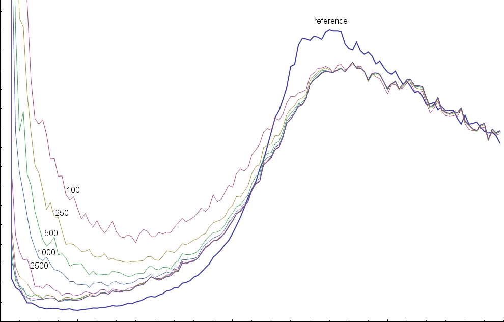
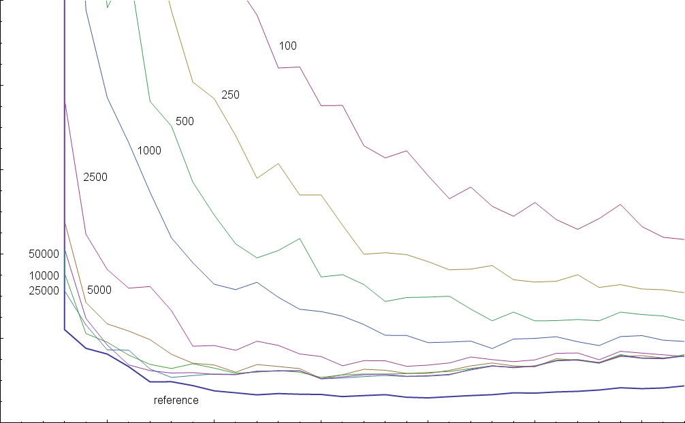

BlueNoise
=========

Command-line program with regular C and OpenCL high-performance tileable blue noise texture generators.

Parallelised implementation of the algorithm detailed in https://arnoldrenderer.com/research/dither_abstract.pdf

Output can be saved to most image formats (pretty much anything DevIL directly supports), and full 32-bit precision floating point .ktx files in GL_RGB32F or GL_RGBA32F format, depending on the number of channels generated.

Currently supports square output sizes in powers-of-two up to 8192 x 8192.

Usage
=====

Run "BlueNoise.exe" without any arguments in the command-line to get program usage information.

Quality / Performance
=====================

The algorithm is fully multithreaded and should use all available cores/threads in software mode.

With default settings (5,000 iterations) on an AMD Ryzen 9 5900X:

|Image size|Time taken|Performance|
|---|---|---|
|128 x 128|1.4 seconds|12 KP/s|
|256 x 256|5.9 seconds|11 KP/s|
|512 x 512|23.8 seconds|11 KP/s|
|1024 x 1024|96.7 seconds|11 KP/s|

With default settings on an Nvidia GTX 1060 3GB:

|Image size|Time taken|Performance|
|---|---|---|
|128 x 128|1.1 seconds|15 KP/s|
|256 x 256|1.7 seconds|38 KP/s|
|512 x 512|4.8 seconds|54 KP/s|
|1024 x 1024|14.2 seconds|73 KP/s
|2048 x 2048|67.3 seconds|62 KP/s|

Performance is linear with respect to the number of iterations performed.

Noise generated using this algorithm has a different frequency spectrum compared to noise generated according to Robert Ulichney's void and cluster method (http://cv.ulichney.com/papers/1993-void-cluster.pdf). Noise generated using the method described in that paper (available from http://momentsingraphics.de/BlueNoise.html) is used as a reference to measure quality of the noise generated by this application.

Radial power distribution of generated 256 x 256 blue noise using a specific number of iterations:

Close-up of lowest frequencies:

Noise generated up to the maximum size supported by this application generally does not show significant improvement in quality after around 10,000 iterations.

**Note:** specifying "-reference" will evaluate the energy function using exactly the equations as described in the reference paper. This mode is both slower and generates worse-quality noise than the default energy evaluation mode, and is included only for the sake of completeness.

Dependencies
============

Uses the DevIL library (https://openil.sourceforge.net/download.php) to load source images. DevIL is licensed under LGPL 2.1. The relevant headers, .libs, .dlls are included in this repository.

Uses libKTX (https://github.com/KhronosGroup/KTX-Software/releases/) to save .ktx outputs. libKTX is licensed under the Apache 2.0 license. The relevant headers, .libs, .dlls are included in this repository.

Uses XXHash hashing library headers (https://github.com/Cyan4973/xxHash) for high-quality random number generation, and an OpenCL port of an old version of XXHash64. XXHash is licensed under the BSD 2-clause license.

Compiling
=========

I personally use Microsoft Visual Studio - Community Edition 2022 to build. I've not tested building using other tools or on other OS's, so your mileage may vary.

You _SHOULD_ use a toolchain with OpenMP support that recognises the relevant #pragma statements in the source. The noise generation will be _extremely_ slow in software mode if you do not have OpenMP support.

You will need to have an OpenCL SDK installed (e.g. https://github.com/KhronosGroup/OpenCL-SDK).

You will need to include the following .libs (included in this repository where possible):

- opengl32.lib
- DevIL.lib
- ILU.lib
- ILUT.lib
- ktx.lib
- opencl.lib

You must include the following .dlls in the same directory as the final executable (or where Windows can otherwise find them):

- DevIL.dll
- ILU.dll
- ILUT.dll
- ktx.dll

Notes Regarding OpenCL
======================

- The OpenCL generator has been tested on an Nvidia GTX 1060. I'm a solo developer so unfortunately I generally don't have access to various different rigs to perform testing on, except when friends are being Helpful. It's entirely possible that you may get OpenCL build errors on your specific hardware, which I'm happy to fix if you bring them to my attention.

- The OpenCL generator initialises by repeatedly doubling the work group size until it either contains the entire data buffer, or it takes >250ms to complete one queued kernel. On most Windows systems, the driver will reset if a kernel occupies the OpenCL device for >2000ms, which is the typical value of TdrDelay (https://learn.microsoft.com/en-us/windows-hardware/drivers/display/tdr-registry-keys). This should never happen under normal circumstances, but may be an issue for very old hardware, so it's worth being aware of.

License
=======

MIT license. You can pretty much do what you like with this code, but please consider attributing me as the source.

Copyright (c) 2023 Craig Sutherland

Permission is hereby granted, free of charge, to any person obtaining a copy
of this software and associated documentation files (the "Software"), to deal
in the Software without restriction, including without limitation the rights
to use, copy, modify, merge, publish, distribute, sublicense, and/or sell
copies of the Software, and to permit persons to whom the Software is
furnished to do so, subject to the following conditions:

The above copyright notice and this permission notice shall be included in all
copies or substantial portions of the Software.

THE SOFTWARE IS PROVIDED "AS IS", WITHOUT WARRANTY OF ANY KIND, EXPRESS OR
IMPLIED, INCLUDING BUT NOT LIMITED TO THE WARRANTIES OF MERCHANTABILITY,
FITNESS FOR A PARTICULAR PURPOSE AND NONINFRINGEMENT. IN NO EVENT SHALL THE
AUTHORS OR COPYRIGHT HOLDERS BE LIABLE FOR ANY CLAIM, DAMAGES OR OTHER
LIABILITY, WHETHER IN AN ACTION OF CONTRACT, TORT OR OTHERWISE, ARISING FROM,
OUT OF OR IN CONNECTION WITH THE SOFTWARE OR THE USE OR OTHER DEALINGS IN THE
SOFTWARE.
